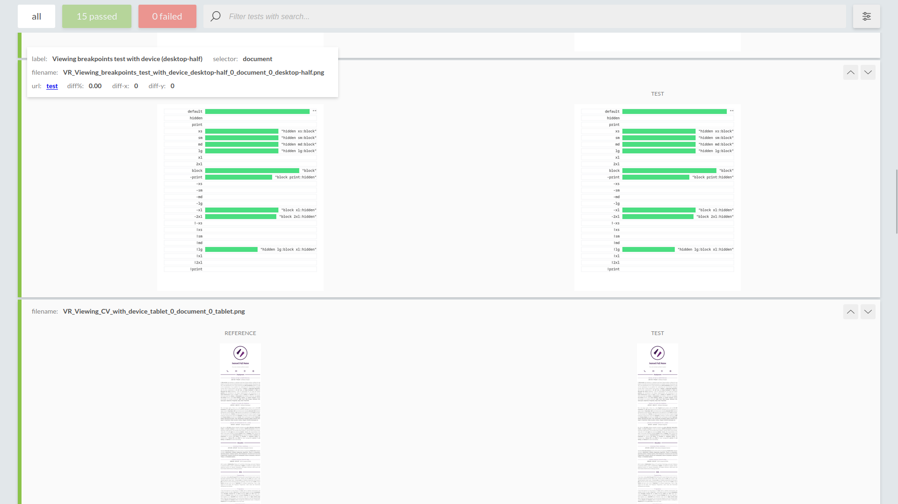
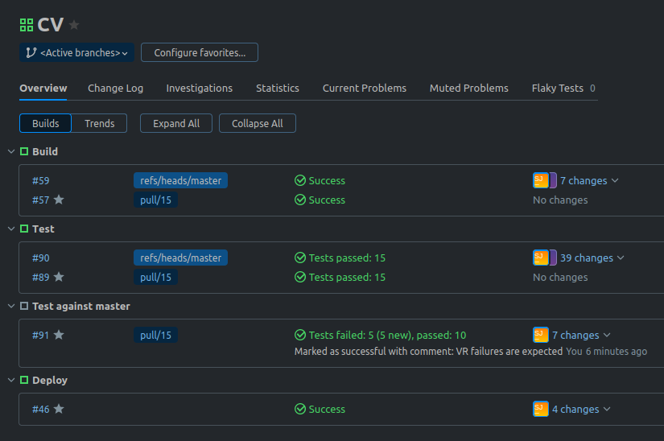
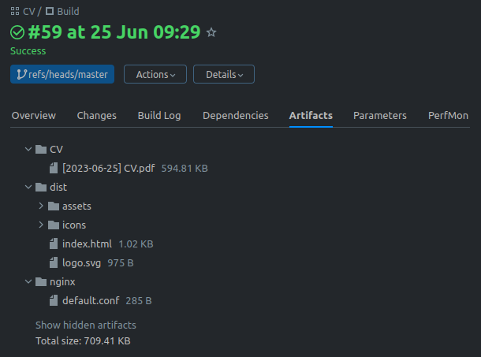

# CV

This is my CV and portfolio, built with **Vite**, **Vue.js**, and **Tailwind CSS**.

### Getting started

This project uses the **pnpm** package manager.

```shell
# npm install -g pnpm
pnpm install
pnpm run install-global
pnpm run lint
pnpm run test
pnpm run build
```

### Output

Generate a PDF of the CV with `pnpm run pdf` or use the **Print to PDF** function in your browser. All the components properly handle the `@media (print)` media query so printing the web page should output a perfectly laid-out document.

### Visual regression testing

Visual regression testing is done with BackstopJS, comparing against the images in
`./visual_regressions/bitmaps_reference/` and `./visual_regressions/pdf_test/png/`.

You can approve visual changes with `pnpm run approve` which will update the reference images.

Here's what a typical test report looks like:



### Pipelines

This is what the TeamCity pipelines for this project look like!



...and the artifact output...


